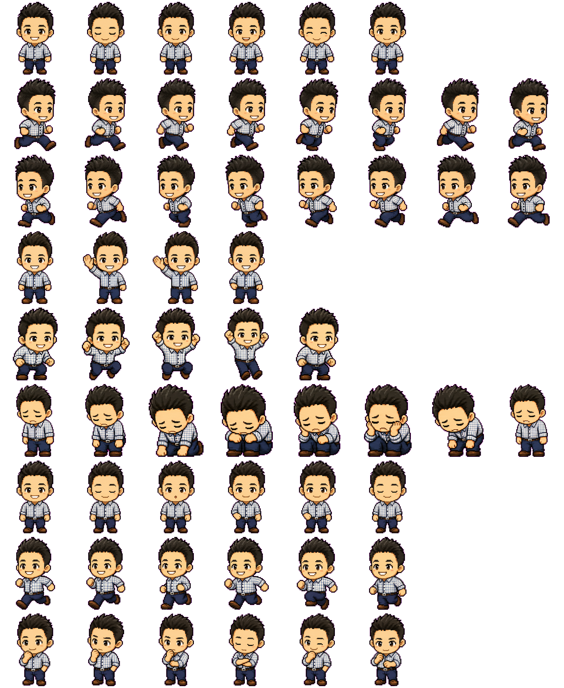

# Codex Pets：Will 保哥

這裡提供一款以 Will 保哥為主題的 Codex 寵物：[Codex Pets](https://developers.openai.com/codex/app/settings#codex-pets)。

安裝之後，你寫 Code 時就不再是孤軍奮戰。

每當你準備硬幹、亂猜、跳過測試、直接上 Production 的時候，牠就會在旁邊用保哥的眼神看著你，彷彿在說：

「你確定這樣寫，三個月後的你不會回來罵今天的你嗎？」

副作用是：
你可能會開始補文件、補測試、重構命名，甚至突然想吃雞排。



## 內容

* `pet.json`
* `spritesheet.webp`

## 安裝

最簡單的安裝方式是在 Codex app 直接輸入以下提示詞：

```text
安裝 doggy8088/codex-pet-willh repo 的 Codex Pet 給我的 Codex app 使用
```

請在終端機執行：

```sh
curl -sL "https://doggy8088.github.io/codex-pet-willh/willh.codex-pet.zip" -o "/tmp/willh.codex-pet.zip" && mkdir -p "$HOME/.codex/pets/willh" && unzip -o "/tmp/willh.codex-pet.zip" -d "$HOME/.codex/pets/willh"
```

執行後，Codex 會在 `$HOME/.codex/pets/willh` 讀取這個寵物。

## 使用

1. 下載並解壓縮寵物檔案。
2. 確認 `$HOME/.codex/pets/willh` 內有 `pet.json` 與 `spritesheet.webp`。
3. 重新啟動 Codex 並到 **設定** > **外觀** > **寵物** 選取 **Will 保哥**。
4. 到聊天視窗輸入 `/pet` 或輸入 `/` 選取「寵物」即可啟用。
5. 然後在聊天視窗輸入任何指令，這個 Codex Pet 就會動起來了！

## 檔案說明

* `pet.json`：寵物的中繼資料。
* `spritesheet.webp`：寵物的圖像素材。
